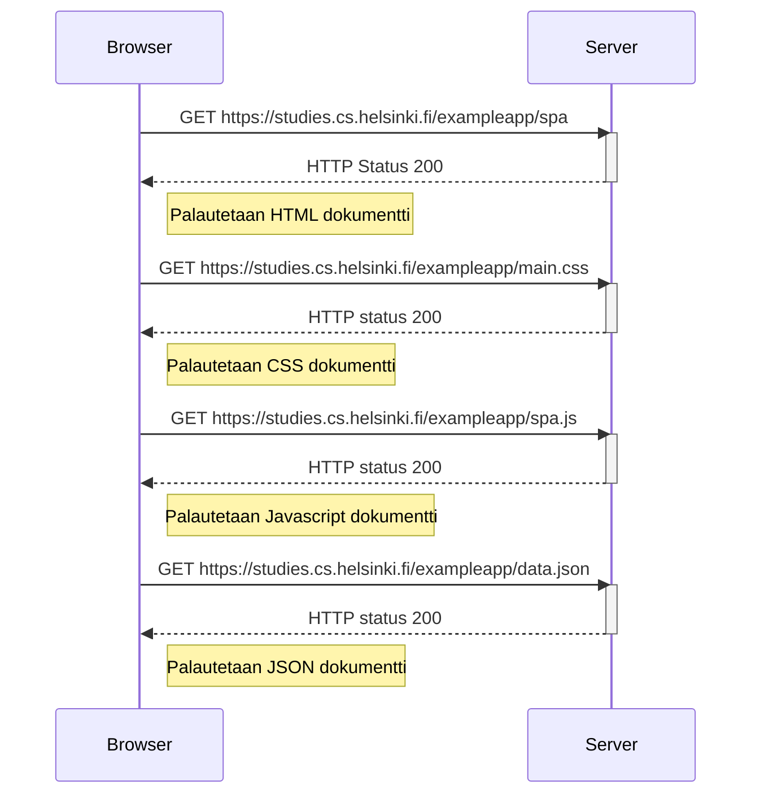

```mermaid
sequenceDiagram
    participant Browser
    participant Server

    Browser->>Server: GET https://studies.cs.helsinki.fi/exampleapp/spa
    activate Server

    Server-->>Browser: HTTP Status 200
    deactivate Server

    Note right of Browser: Palautetaan HTML dokumentti

    Browser->>Server: GET https://studies.cs.helsinki.fi/exampleapp/main.css
    activate Server
    Server-->>Browser: HTTP status 200
    deactivate Server

    Note right of Browser: Palautetaan CSS dokumentti

    Browser->>Server: GET https://studies.cs.helsinki.fi/exampleapp/spa.js
    activate Server
    Server-->>Browser: HTTP status 200
    deactivate Server

    Note right of Browser: Palautetaan Javascript dokumentti

    Browser->>Server: GET https://studies.cs.helsinki.fi/exampleapp/data.json
    activate Server
    Server-->>Browser: HTTP status 200
    deactivate Server

    Note right of Browser: Palautetaan JSON dokumentti
```
