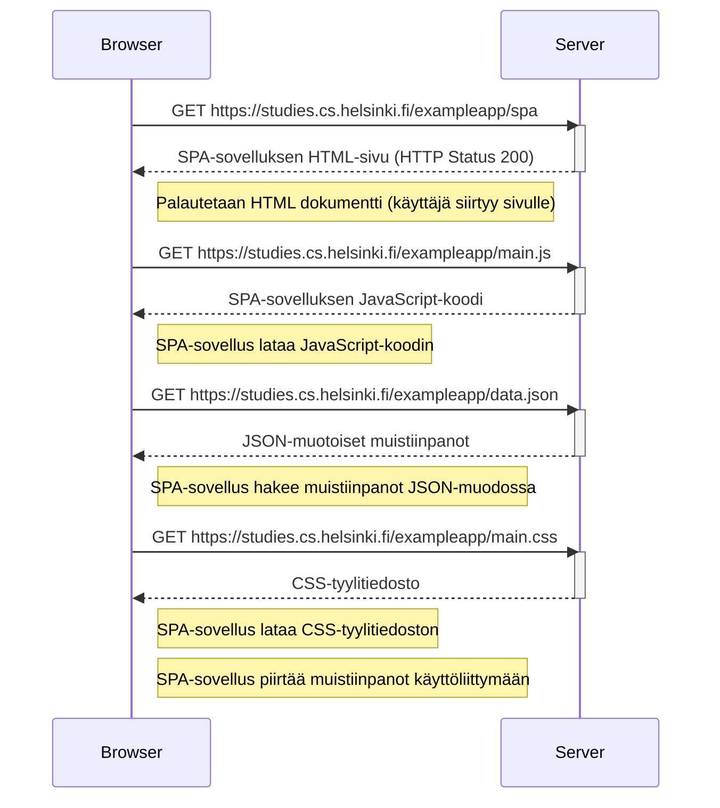

```mermaid
sequenceDiagram
    participant Browser
    participant Server

    Browser->>Server: GET https://studies.cs.helsinki.fi/exampleapp/spa
    activate Server

    Server-->>Browser: SPA-sovelluksen HTML-sivu (HTTP Status 200)
    deactivate Server

    Note right of Browser: Palautetaan HTML dokumentti (käyttäjä siirtyy sivulle)

    Browser->>Server: GET https://studies.cs.helsinki.fi/exampleapp/main.js
    activate Server

    Server-->>Browser: SPA-sovelluksen JavaScript-koodi
    deactivate Server

    Note right of Browser: SPA-sovellus lataa JavaScript-koodin

    Browser->>Server: GET https://studies.cs.helsinki.fi/exampleapp/data.json
    activate Server

    Server-->>Browser: JSON-muotoiset muistiinpanot
    deactivate Server

    Note right of Browser: SPA-sovellus hakee muistiinpanot JSON-muodossa

    Browser->>Server: GET https://studies.cs.helsinki.fi/exampleapp/main.css
    activate Server

    Server-->>Browser: CSS-tyylitiedosto
    deactivate Server

    Note right of Browser: SPA-sovellus lataa CSS-tyylitiedoston

    Note right of Browser: SPA-sovellus piirtää muistiinpanot käyttöliittymään
```
