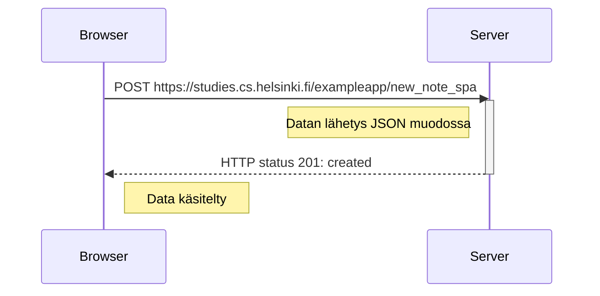

```mermaid
sequenceDiagram
    participant Browser
    participant Server

    Browser->>Server: POST https://studies.cs.helsinki.fi/exampleapp/new_note_spa
    activate Server

    Note left of Server: Datan lähetys JSON muodossa

    Server-->>Browser: HTTP status 201: created
    deactivate Server

    Note right of Browser: Data käsitelty
```
