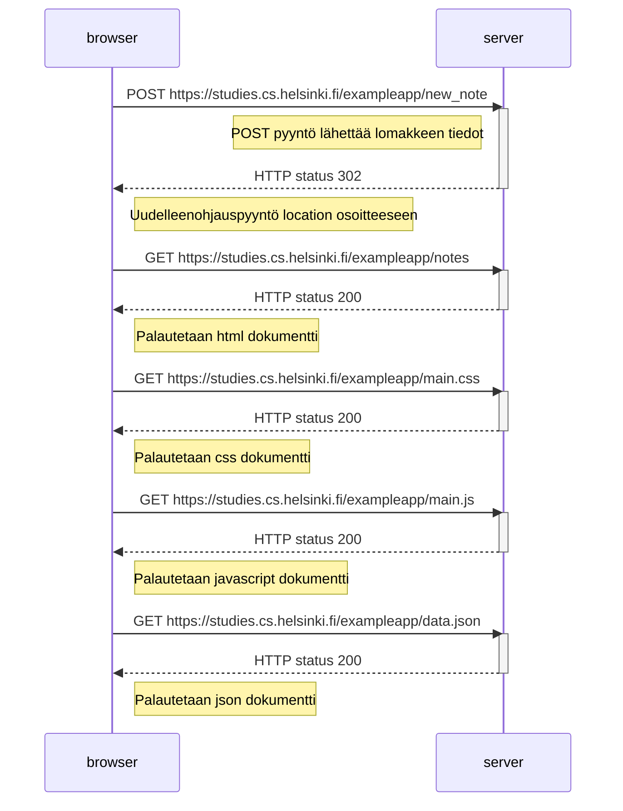

```mermaid
sequenceDiagram
    participant browser
    participant server

    browser->>server: POST https://studies.cs.helsinki.fi/exampleapp/new_note
    activate server

    Note left of server: POST pyyntö lähettää lomakkeen tiedot 

    server-->>browser: HTTP status 302
    deactivate server

    Note right of browser: Uudelleenohjauspyyntö location osoitteeseen

    browser->>server: GET https://studies.cs.helsinki.fi/exampleapp/notes
    activate server
    server-->>browser: HTTP status 200
    deactivate server

    Note right of browser: Palautetaan html dokumentti

    browser->>server: GET https://studies.cs.helsinki.fi/exampleapp/main.css
    activate server
    server-->>browser: HTTP status 200
    deactivate server 

    Note right of browser: Palautetaan css dokumentti

    browser->>server: GET https://studies.cs.helsinki.fi/exampleapp/main.js
    activate server
    server-->>browser: HTTP status 200
    deactivate server 

    Note right of browser: Palautetaan javascript dokumentti

    browser->>server: GET https://studies.cs.helsinki.fi/exampleapp/data.json
    activate server
    server-->>browser: HTTP status 200
    deactivate server

    Note right of browser: Palautetaan json dokumentti

```
