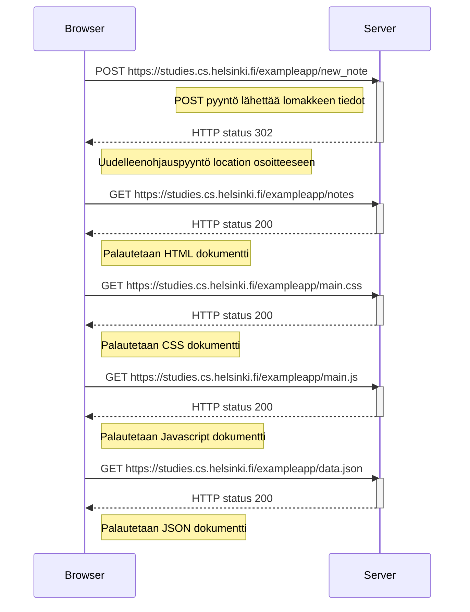

```mermaid
sequenceDiagram
    participant Browser
    participant Server

    Browser->>Server: POST https://studies.cs.helsinki.fi/exampleapp/new_note
    activate Server

    Note left of Server: POST pyyntö lähettää lomakkeen tiedot 

    Server-->>Browser: HTTP status 302
    deactivate Server

    Note right of Browser: Uudelleenohjauspyyntö location osoitteeseen

    Browser->>Server: GET https://studies.cs.helsinki.fi/exampleapp/notes
    activate Server
    Server-->>Browser: HTTP status 200
    deactivate Server

    Note right of Browser: Palautetaan HTML dokumentti

    Browser->>Server: GET https://studies.cs.helsinki.fi/exampleapp/main.css
    activate Server
    Server-->>Browser: HTTP status 200
    deactivate Server 

    Note right of Browser: Palautetaan CSS dokumentti

    Browser->>Server: GET https://studies.cs.helsinki.fi/exampleapp/main.js
    activate Server
    Server-->>Browser: HTTP status 200
    deactivate Server 

    Note right of Browser: Palautetaan Javascript dokumentti

    Browser->>Server: GET https://studies.cs.helsinki.fi/exampleapp/data.json
    activate Server
    Server-->>Browser: HTTP status 200
    deactivate Server

    Note right of Browser: Palautetaan JSON dokumentti

```
